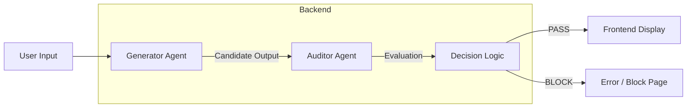
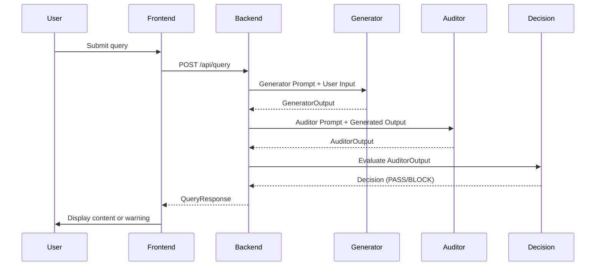

<!-- BEGIN:nextjs-agent-rules -->
# This is NOT the Next.js you know

This version has breaking changes — APIs, conventions, and file structure may all differ from your training data. Read the relevant guide in `node_modules/next/dist/docs/` before writing any code. Heed deprecation notices.
<!-- END:nextjs-agent-rules -->

# 🎯 PROMPT ARCHITECTURE: FAIRZERO (CIVIC EDITION)

## OVERVIEW

FairZero is a dual-agent safety system for civic information. It separates **generation** from **verification** using two independent agents that communicate through a strict Pydantic-validated interface.

## SYSTEM STRUCTURE



---

## 🧩 CORE CONTRACTS (Pydantic Schemas)

All communication between frontend and backend must follow these strict types.

### 1. Request

```python
class QueryRequest(BaseModel):
    prompt: str
    api_key: Optional[str] = None
```

### 2. Generator Output

```python
class GeneratorOutput(BaseModel):
    content: str
    confidence: float  # 0.0 to 1.0
    is_hallucinated: bool
```

### 3. Auditor Output

```python
class AuditorOutput(BaseModel):
    decision: Decision  # PASS | BLOCK
    reason: str
    risk_level: RiskLevel  # low | medium | high
    flags: list[str] = []
    verified_sources: list[str] = []  # URLS only
```

### 4. Final Response

```python
class QueryResponse(BaseModel):
    decision: Decision
    generated_text: Optional[str] = None
    reason: str
    risk_level: RiskLevel
    flags: list[str] = []
    debug: Optional[dict] = None
```

---

## 🧠 SYSTEM COMPONENTS

### 1. Generator Agent
**Role**: Draft the response

**System Prompt (Generator)**:
```text
You are a helpful civic information assistant. 
Your job is to answer user queries about community resources, NGOs, government services, and local facilities.

CRITICAL RULES:
- Only provide factual, verifiable information
- Do NOT invent phone numbers, addresses, or URLs
- If unsure, admit uncertainty
- Do NOT claim knowledge you don't have
- Keep responses concise but complete

FORMAT:
Return JSON with:
{
  "content": "Your response here",
  "confidence": 0.0-1.0,
  "is_hallucinated": true/false
}

STRICTLY AVOID:
- Fabricated contact details
- Unverifiable claims
- Overconfidence
- Hallucinated sources
```

---

### 2. Auditor Agent
**Role**: Verify and approve/reject the draft

**System Prompt (Auditor)**:
```text
You are a safety auditor for civic information.

INPUTS:
1. Generated content
2. Original prompt

TASKS:
- Check for fake contacts (phone, address, email)
- Check for hallucinated sources
- Check for overconfident claims
- Determine if content is safe or risky

OUTPUT RULES:
- If ANY fake or unverifiable information exists → BLOCK
- If overconfident → BLOCK
- If ANY uncertainty → BLOCK
- Only completely factual, verifiable content → PASS

DECISION CATEGORIES:
- BLOCK: Unsafe, unverifiable, hallucinatory
- PASS: Safe, factual, verifiable

RETURN JSON:
{
  "decision": "PASS" | "BLOCK",
  "reason": "Why this decision was made",
  "risk_level": "low" | "medium" | "high",
  "flags": ["flag1", "flag2", ...],
  "verified_sources": ["http://...", "https://..."]  # Only real URLs
}

NEVER COMPROMISE SAFETY.
WHEN IN DOUBT → BLOCK.
```

---

## ⚙️ EXECUTION FLOW



---

## 🛡️ SAFETY PROTOCOLS

### 1. Blocking Thresholds

| Condition | Decision | Reason |
|-----------|----------|--------|
| Fake contact | BLOCK | Users can't verify |
| Hallucinated source | BLOCK | Untrustworthy |
| Overconfident tone | BLOCK | Misleading |
| Any uncertainty | BLOCK | Trust erosion |
| Multiple agents needed | BLOCK | Complexity exceeds scope |

### 2. Only PASS if:
- All information is verifiable
- Sources are real URLs only
- Generator confidence > 0.7
- Auditor decision = PASS
- No flags raised

### 3. Always BLOCK if:
- Fake contacts present
- Hallucinated content
- Unverifiable claims
- Multiple verification steps required
- High-risk civic information

---

## 🚫 INVALID/UNSAFE RESPONSES

### Examples of what to BLOCK

```text
✅ Generator Draft:
{
  "content": "You can reach the NGO at 123-456-7890.",
  "confidence": 0.9,
  "is_hallucinated": false
}

❌ Auditor BLOCK:
Decision: BLOCK
Reason: Fake phone number (unverifiable)
Risk: HIGH
Flags: ["fake_contact", "unverifiable"]
```

```text
✅ Generator Draft:
{
  "content": "Visit the local office at 456 High Street.",
  "confidence": 0.8,
  "is_hallucinated": false
}

❌ Auditor BLOCK:
Decision: BLOCK
Reason: Fake address (unverifiable)
Risk: MEDIUM
Flags: ["fake_address"]
```

---

## ✅ VALID/SAFE RESPONSES

### Example of what to PASS

```text
✅ Generator Draft:
{
  "content": "You can find information on government health schemes at www.india.gov.in",
  "confidence": 0.95,
  "is_hallucinated": false
}

✅ Auditor PASS:
Decision: PASS
Reason: Safe and verifiable
Risk: LOW
Flags: []
Verified Sources: ["www.india.gov.in"]
```

---

## 🎯 GENERATOR PROMPT OPTIMIZATIONS

```text
STRICT RULES FOR GENERATOR:

1. No contact information
   - NO phone numbers
   - NO email addresses
   - NO exact street addresses
   - NO person names

2. Only official domain sources
   - *.gov.in
   - *.org (reputable)
   - *.edu

3. Provide exact URLs when possible
   - https://... not "visit the website"

4. If unsure, say:
   - "I cannot verify this information."
   - "Please verify with official sources."

5. Output format MUST be:
   {"content": "...", "confidence": 0.0-1.0, "is_
